# HW-NAS-Memetic: A Multi-Level Hybrid Metaheuristic for Edge AI


## 1. Overview

HW-NAS-Memetic combines a MOEA/D scaffold with discrete PSO and Simulated Annealing to solve hardware-aware NAS in a topology-preserving way. The algorithm is designed for NAS-Bench-201/HW-NAS-Bench, where discrete edge operations are highly epistatic.

Key features:

- **Config-driven search** via `scripts/run_search.py` and `configs/full_proposed.json`
- **Calibrated MOEA/D schedule** using `w_init` and `w_final` to span a tuned accuracy-latency trade-off
- **Manual analysis workflow**: notebooks are analysis artifacts, not pipeline steps
- **Full sweep orchestration** via `run_full_pipeline.sh` across datasets and hardware metrics

## 2. Core Algorithm Configuration

### 2.1 MOEA/D weight schedule

MOEA/D decomposes the bi-objective search into `K` scalar sub-problems, each with a weight vector `(w0, w1)`.
The schedule is produced by linearly sampling accuracy weights between `w_init` and `w_final` and using `w1 = 1 - w0`.

```python
w0 = np.linspace(self.w_init, self.w_final, K)
w1 = 1.0 - w0
```

This creates a set of trade-off directions across accuracy and latency.

### 2.2 Runtime configuration

`run_search.py` supports both a JSON configuration file and CLI overrides.
The default config path is `configs/full_proposed.json`, and common runtime parameters include:

- MOEA/D settings: `k_directions`, `w_init`, `w_final`, `scalarization`, `t_neighborhood`
- SA settings: `t0`, `alpha`, `use_restart`
- PSO settings: `c1_init`, `c2_init`, `eta`, `target_rate`
- GA settings: `p_m`, `ga_force_change`, `ga_crossover`, `ga_freq_bias`, `ga_adaptive`

### 2.3 Execution workflow

The full experimental pipeline is orchestrated by `run_full_pipeline.sh`.
It drives a sweep over datasets and hardware metrics, while the notebooks in `notebooks/` remain dedicated analysis artifacts rather than automated pipeline steps.

## 3. Solution Components and Code Location

### 3.1 MOEA/D core (`src/algorithms/memetic_nas.py`)

This module contains the main search engine:

- `MemeticNAS.__init__()` stores `w_init` and `w_final`
- `_make_weights()` constructs the MOEA/D weight vectors
- `search()` performs candidate generation, SA acceptance, and restart logic

### 3.2 Discrete PSO operator (`src/algorithms/operators/pso_operator.py`)

PSO generates proposals by pulling discrete edge values toward personal best and neighborhood best states.

### 3.3 GA operator (`src/algorithms/operators/ga_operator.py`)

GA mutation uses calibrated DNA from the tuning registry:

- `p_m = 0.16667`
- `force_change = true`
- `crossover = true`
- `freq_bias = true`
- `adaptive = false`

### 3.4 SA acceptance (`src/algorithms/operators/sa_operator.py`)

Acceptance is controlled by Metropolis probability:

```python
if self.sa_op is not None:
    accepted, T_sa = self.sa_op.step(scores[k], best_g, self.rng)
else:
    accepted = best_g > scores[k]
```

Temperature decays as:

```python
T_{t+1} = \alpha T_t
```

### 3.5 Configuration loader (`scripts/run_search.py`)

`run_search.py` reads `configs/full_proposed.json` and uses its values for CLI defaults, while allowing runtime override via command-line arguments.
This centralizes search parameterization and keeps the proposed search reproducible across runs.

## 4. Algorithm Architecture: Proposed Memetic NAS

The diagram below is derived directly from `MemeticNAS.search()`, `GAOperator.apply()`, `PSOOperator.apply()`, and `SAOperator.step()`.

```mermaid
%%{init: {'themeVariables': {'fontSize': '18px', 'nodeTextSize': 18, 'primaryBorderColor': '#000000', 'edgeLabelBackground':'#ffffff', 'clusterBkg': '#f9f9f9'}}}%%
flowchart TD
classDef init fill:#e8eaf6,stroke:#3f51b5,stroke-width:2px,color:#000
classDef operator fill:#e3f2fd,stroke:#1976d2,stroke-width:2px,color:#000
classDef sa fill:#fce4ec,stroke:#c2185b,stroke-width:2px,color:#000
classDef decision fill:#fff3e0,stroke:#f57c00,stroke-width:2px,color:#000
classDef archive fill:#e8f5e9,stroke:#2e7d32,stroke-width:2px,color:#000
classDef standard fill:#ffffff,stroke:#757575,stroke-width:1px,color:#000
style Start fill:#ffffff,stroke:#757575,stroke-width:2px,width:300px,height:90px,padding:20px
style Archive fill:#e8f5e9,stroke:#2e7d32,stroke-width:2px,width:340px,height:90px,padding:20px
style Budget fill:#ffffff,stroke:#757575,stroke-width:2px,width:320px,height:90px,padding:20px
style SubLoopStart fill:#ffffff,stroke:#757575,stroke-width:2px,width:340px,height:90px,padding:20px
style SelectBest fill:#ffffff,stroke:#757575,stroke-width:2px,width:340px,height:90px,padding:20px
style Metropolis fill:#fff3e0,stroke:#f57c00,stroke-width:2px,width:320px,height:90px,padding:20px
style CheckPBest fill:#fff3e0,stroke:#f57c00,stroke-width:2px,width:320px,height:90px,padding:20px
style NextK fill:#fff3e0,stroke:#f57c00,stroke-width:2px,width:320px,height:90px,padding:20px
style RestartCheck fill:#fff3e0,stroke:#f57c00,stroke-width:2px,width:320px,height:90px,padding:20px
style W fill:#e8eaf6,stroke:#3f51b5,stroke-width:2px,width:340px,height:90px,padding:20px
style Nb fill:#e8eaf6,stroke:#3f51b5,stroke-width:2px,width:300px,height:90px,padding:20px
style Pop fill:#e8eaf6,stroke:#3f51b5,stroke-width:2px,width:340px,height:90px,padding:20px
style EvalInit fill:#e8eaf6,stroke:#3f51b5,stroke-width:2px,width:340px,height:90px,padding:20px
style GA fill:#e3f2fd,stroke:#1976d2,stroke-width:2px,width:320px,height:90px,padding:20px
style PSO fill:#e3f2fd,stroke:#1976d2,stroke-width:2px,width:320px,height:90px,padding:20px
style Acc fill:#fce4ec,stroke:#c2185b,stroke-width:2px,width:320px,height:90px,padding:20px
style Rej fill:#fce4ec,stroke:#c2185b,stroke-width:2px,width:320px,height:90px,padding:20px
style UpPBest fill:#ffffff,stroke:#757575,stroke-width:2px,width:320px,height:90px,padding:20px
style Propagate fill:#ffffff,stroke:#757575,stroke-width:2px,width:360px,height:90px,padding:20px
style Reinit fill:#ffffff,stroke:#757575,stroke-width:2px,width:340px,height:90px,padding:20px

Start([Initialize Search])
Archive[(Global Pareto Archive)]
Budget{"NFE Budget Remaining?"}
SubLoopStart["Update gbest_k from T_n"]
SelectBest["Evaluate GA + PSO<br/>Select best_g"]
Metropolis{"Accept move?<br/>exp(delta_g / T)"}
GA["GA Operator<br/>Mutation + Crossover"]
PSO["PSO Operator<br/>Velocity toward pbest + gbest"]
Acc["Accept and Update current_k"]
Rej[Reject and keep previous]
CheckPBest{"best_g > pbest_k?"}
UpPBest[Update pbest_k]
Propagate["Propagate to Neighbors<br/>Update gbest_n if improved"]
NextK{"k less than K-1?"}
RestartCheck{"100 iters stagnation?"}
Reinit["Reinit worst K/2<br/>solutions"]
W["Build Weight Vectors<br/>linspace w_init to w_final"]
Nb[Compute T_n Neighborhoods]
Pop["Initialize Population<br/>K discrete architectures"]
EvalInit["Evaluate and Scalarize g-scores"]

subgraph Phase1 [1 MOEAD Init]
    W
    Nb
    Pop
    EvalInit
    W --> Nb --> Pop --> EvalInit
end

subgraph Phase2 [2 Sub-problem Loop]
    SubLoopStart
    subgraph Operators [3 Memetic Generation]
        GA
        PSO
        GA --> PSO
    end
    SelectBest
end

subgraph SAGate [4 Simulated Annealing Gate]
    Metropolis
    Acc
    Rej
    Metropolis -- Yes --> Acc
    Metropolis -- No --> Rej
end

subgraph Update [5 Neighborhood Update]
    CheckPBest
    UpPBest
    Propagate
    CheckPBest -- Yes --> UpPBest --> Propagate
    CheckPBest -- No --> Propagate
end

subgraph Stagnation [6 Restart Management]
    RestartCheck
    Reinit
    RestartCheck -- Yes --> Reinit
end

Start --> W
EvalInit --> Budget
Budget -- Exhausted --> Archive
Budget -- Yes --> SubLoopStart
SubLoopStart --> GA
PSO --> SelectBest
SelectBest --> Metropolis
Acc --> CheckPBest
Rej --> CheckPBest
Propagate --> NextK
NextK -- Yes --> SubLoopStart
NextK -- No --> RestartCheck
RestartCheck -- No --> Budget
Reinit --> Budget

class W,Nb,Pop,EvalInit init
class GA,PSO operator
class Budget,Metropolis,CheckPBest,RestartCheck,NextK decision
class Acc,Rej sa
class Archive archive
class Start,SubLoopStart,SelectBest,UpPBest,Propagate,Reinit standard
```



**Legend**

| Symbol | Meaning |
|--------|---------|
| Rectangle | Deterministic process (data transformation, evaluation, update) |
| Diamond | Decision gate |
| Cylinder | Persistent data store (the global Pareto archive) |
| `eval_fn` | Lookup call into HW-NAS-Bench — returns `(accuracy, latency)` |
| `g-score` | MOEA/D scalarization: `g = w0 × acc − w1 × lat` (linear mode) |
| `SA Accept` | Metropolis criterion: always accept if `delta_g > 0`; probabilistically accept worse moves |
| `Propagate` | Improvement is shared with T_n neighbors — the MOEA/D cooperative step |
| `Restart` | Diversity injection: worst K//2 solutions replaced after 100 stagnant outer iterations |

## 6. Search Space and Encoding

### NAS-Bench-201 cell

The search space is a 4-node DAG with 6 directed edges. Each edge chooses one of 5 operations:

| Index | Operation |
|-------|-----------|
| 0 | `none` |
| 1 | `skip_connect` |
| 2 | `avg_pool_3x3` |
| 3 | `nor_conv_1x1` |
| 4 | `nor_conv_3x3` |

Architectures are vectors in $\{0,1,2,3,4\}^6$.

### Hardware evaluation

The benchmark provides lookup access via:

- `api.query(arch, device, dataset, metric)`
- `api.query_accuracy(arch, dataset)`

## 7. Repository Structure

```
HW-NAS-Memetic/
├── configs/
│   └── full_proposed.json
├── data/
│   └── HW-NAS-Bench-v1_0.pickle
├── notebooks/
│   ├── 01_parameter_calibration.ipynb
│   ├── 01_pareto_front_viz.ipynb
│   └── ...
├── results/
│   ├── baselines/
│   └── proposed/
├── scripts/
│   ├── download_data.py
│   ├── run_baselines.py
│   ├── run_search.py
│   ├── run_ablations.py
│   ├── run_incremental_build.py
│   └── run_full_pipeline.sh
├── src/
│   ├── algorithms/
│   ├── api/
│   ├── analysis/
│   ├── operators/
│   └── utils/
└── test/
```

## 8. Installation

```bash
git clone https://github.com/AbdeslemHMN/HW-NAS-Memetic.git
cd HW-NAS-Memetic
python3 -m venv venv
source venv/bin/activate
pip install -r requirements.txt
python scripts/download_data.py
```

## 9. Running the full pipeline

```bash
chmod +x run_full_pipeline.sh
./run_full_pipeline.sh
```

This runs the 3×3 sweep across datasets and hardware targets.

Dry run:

```bash
DRY_RUN=1 ./run_full_pipeline.sh
```

## 10. Running the proposed search directly

```bash
python scripts/run_search.py --config configs/full_proposed.json
```

Override defaults:

```bash
python scripts/run_search.py --config configs/full_proposed.json \
    --hardware eyeriss_latency \
    --k_directions 5 \
    --w_init 0.6 \
    --w_final 0.4 \
    --t0 0.1 \
    --alpha 0.95 \
    --c1 0.4 \
    --c2 0.6
```

## 11. Notes

- `configs/full_proposed.json` now stores calibrated `operator_dna` and `calibration_metadata`.
- The notebook calibration path remains manual.
- Notebooks are not executed automatically by `run_full_pipeline.sh`.
